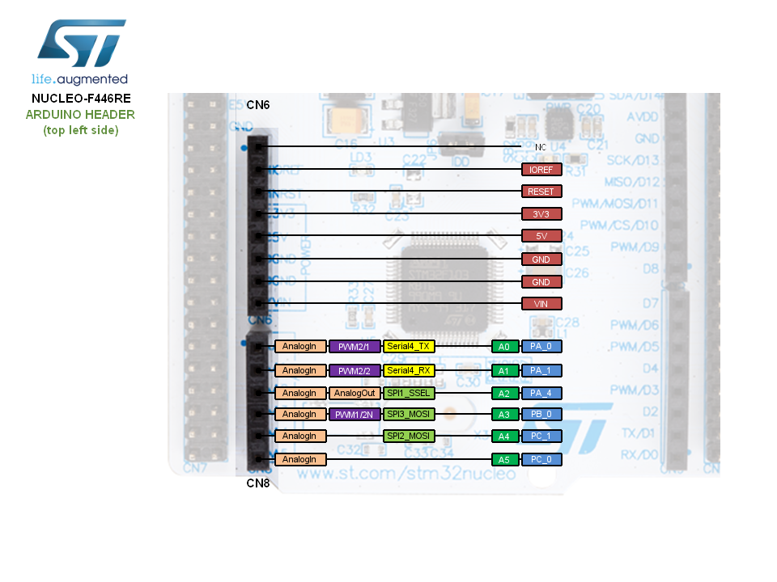
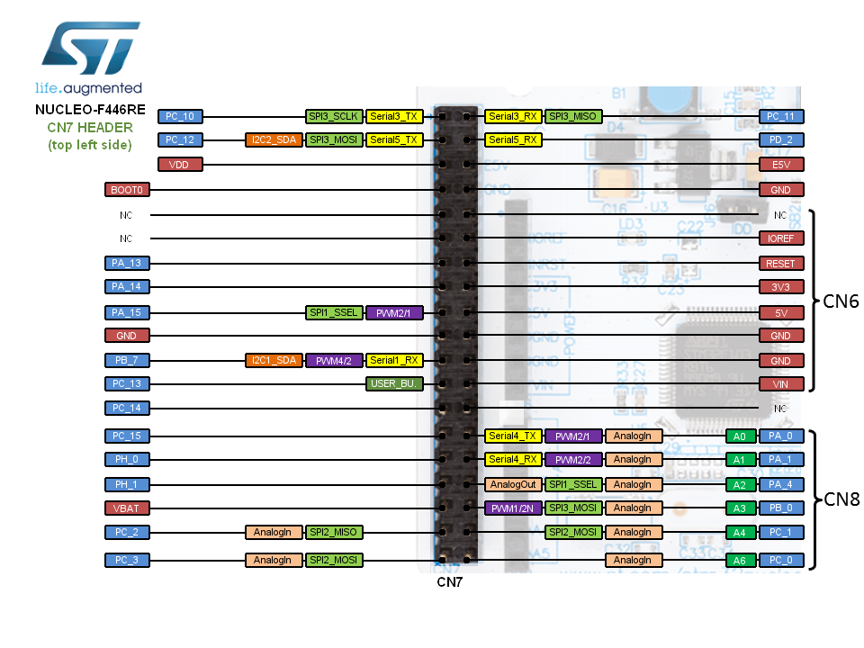
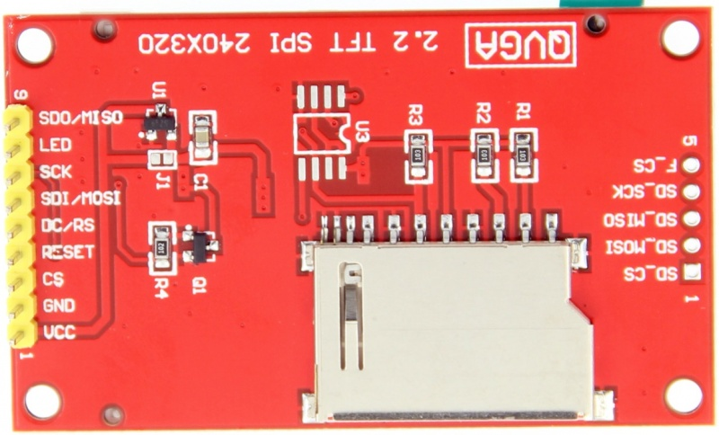

# STM32F446RE Pinout

[HOME](README.MD) | [PINOUT](PINOUT.MD) | [CONNECTIONS](PIN_CONNECTIONS.MD)

## Mbed STM32F446RE Pinout

### Arduino Type Left Pinout

### Arduino Type Right Pinout

### Morpho Type Left Pinout

### Morpho Type Right Pinout

## IL9341 2.2" TFT 340x220 SPI

