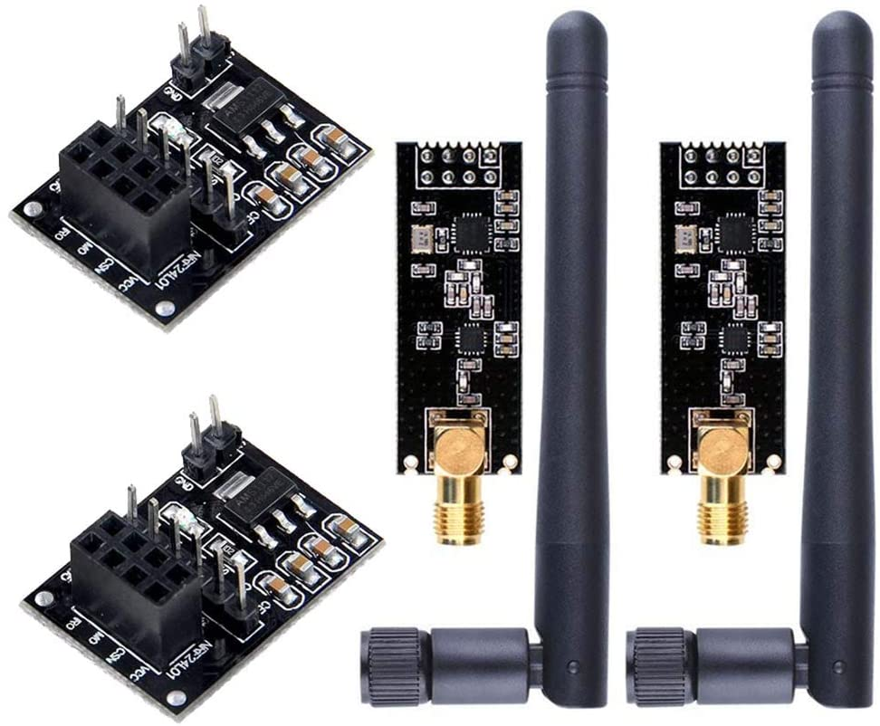
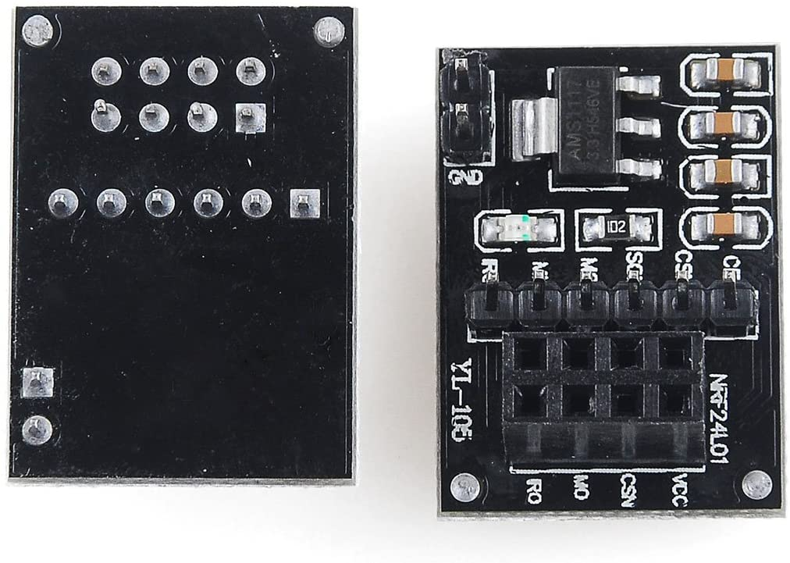
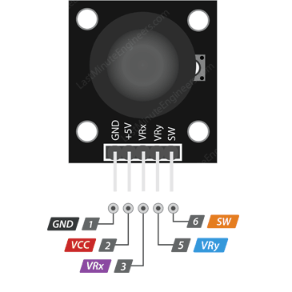

# Component Pin Connections

[HOME](README.md) | [PINOUT](PINOUT.md) | [CONNECTIONS](PIN_CONNECTIONS.md)

## Interfacing IL9341 TFT to NUCLEO F446RE

### Morpho Type Right Pinout

|**IL9341 Pin Label** | **IL9341 PIN#** | **Description**    | **NUCLEO F446RE PIN#** |
| --------------- | ---------------- | --------------------- | ----------------- |
| VCC             | 1                | 5V/3.3V power input|         5V (Arduino pinout) |
| GND             | 2                | Ground|                      GND (Arduino pinout) |
| CS              | 3                | LCD chip select signal, Active LOW | PA_10(D2) |
| RESET           | 4                | LCD reset signal, Active LOW | PA_8(D7)|
| DC/RS           | 5                | LCD register / data selection signal, high level: register, low level: data | PB_10(D6)|
| MOSI            | 6                | SPI Bus Write data signal |  PB_5(D4)
| SCK             | 7                | SPI Bus Clock |              PB_3(D3)
| LED             | 8                | Backlight control |          5V(Arduino PInout)|
| MISO            | 9                | SPI bus read data signal |   PB_4(D5) |

## Interfacing nRF24L01 to NUCLEO F446RE

### nRF24l01 boards

### nRF24l01 Breakout board pinout

### nRF24l01 Breakout Connections

|**nRF24 Breakout PIN** | **Description** | **NUCLEO F446RE PIN#** |
| --------------- | ---------------- | --------------------- |
| VCC             | 5V/3.3V power input         | 5V (Arduino pinout) |
| GND             | Ground                      | GND (Arduino pinout)|
| CE              | Chip Enable, Active Low     | PB_2|
| CSN             | Chip Select                 | PB_1 |
| SCK             | SPI Clock Signal            | PB_13|
| MOSI            | SPI Wire Data Signal        | PB_15|
| MISO            | SPI Read Data Signal        | PB_14|
| IRQ             | Interrupt pin. Active LOW   | PC_4 |

## Interfacing PS2 Joystick Pinout

### PS2 Joystick Circuit

### Joystick Connections

|**PS2 Joystick Pinout** | **Description** | **NUCLEO F446RE PIN#** |
| ---------------------- | --------------- | ---------------------- |
| GND                    | Ground          | GND (Arduino pinout)|
| +5V                    | 5V power input  | 5V (Arduino pinout) |
| VRX                    | Voltage across Horizontal-direction varistor |  PA_0(A0)|
| VRX                    | Voltage across Vertical-direction varistor   |  PA_1(A1)|
| SW                     | Digital Switch Output for Key press          |  PH_1 |
